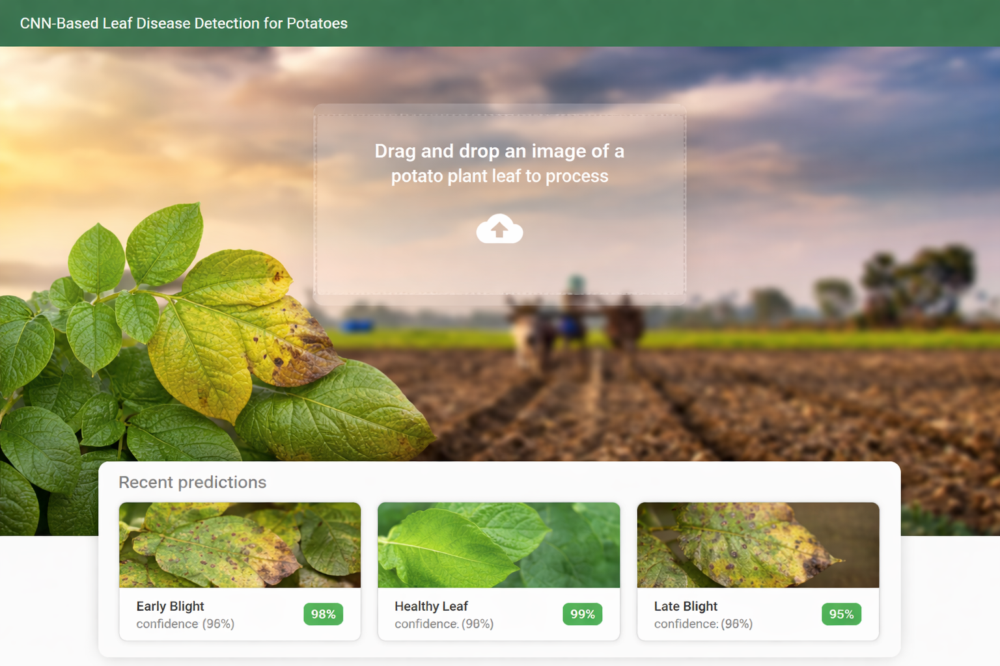

# 🌱 Potato Leaf Disease Detection (AI + Full-Stack)

An AI-powered web application that detects and classifies potato leaf diseases using a **Convolutional Neural Network (CNN)**. The system allows users to upload leaf images and receive real-time predictions with confidence scores.

---

## 📸 Demo Preview

<p align="center">
  
</p>

---

## 📌 Project Overview

This application leverages deep learning to assist in **early detection of potato plant diseases**, helping improve crop health and agricultural productivity.

Users can upload images of potato leaves through a **React-based interface**, while a **FastAPI backend** processes the image using a trained CNN model and returns predictions instantly.

The project demonstrates the integration of **AI models into real-world web applications**, combining machine learning with modern frontend and backend technologies.

---

## ⚙️ How It Works

1. User uploads a potato leaf image via the web interface  
2. Image is sent to the FastAPI backend  
3. Backend preprocesses the image for model input  
4. CNN model predicts the disease category  
5. Prediction with confidence score is returned and displayed  

---

## ✨ Key Features

- 🌿 **AI-Based Disease Classification**
  - Detects multiple potato leaf diseases
  - Provides prediction with confidence scores

- ⚡ **Real-Time Inference**
  - FastAPI backend ensures quick response times
  - Efficient model integration for real-time usage

- 🖼️ **Image Upload Interface**
  - Drag-and-drop or file upload support
  - Instant preview before prediction

- 🔄 **Seamless Frontend-Backend Integration**
  - REST API communication between React and FastAPI
  - Smooth user experience

- 📊 **Confidence Score Display**
  - Helps users understand prediction reliability

- 🌐 **Deployment Ready**
  - Configured for cloud deployment (Render)

---

## 🏗️ Tech Stack

### Frontend
- React.js
- Axios
- Tailwind CSS (if used)

### Backend
- FastAPI
- Python

### Machine Learning
- TensorFlow / Keras
- CNN (Convolutional Neural Network)

### Tools & Deployment
- Render
- Git & GitHub

---

## 📁 Project Structure

```bash
root/
│
├── api/             # FastAPI backend
├── frontend/        # React frontend
├── saved_models/    # Trained CNN model (.h5)
├── potatoDisease.ipynb   # Model training notebook
├── requirements.txt
└── render.yaml
```

---

## 🧠 Model Details

- Model Type: Convolutional Neural Network (CNN)
- Framework: TensorFlow / Keras
- Input: Potato leaf images
- Output: Disease classification label + confidence score

---

## 🚀 Use Cases

- 🌾 Early disease detection in agriculture  
- 👨‍🌾 Assistance for farmers and agronomists  
- 📊 AI-based crop monitoring systems  
- 🌍 Smart agriculture solutions  

---

## 📬 Contact

- GitHub: https://github.com/vivek-c29/
- LinkedIn: https://www.linkedin.com/in/vivek-chauhan-b8ab22304/

---

## ⭐ Support

If you found this project useful, consider giving it a ⭐ on GitHub!